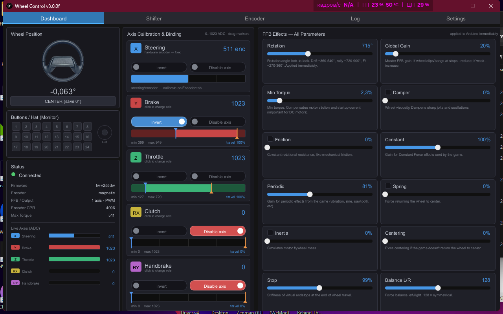
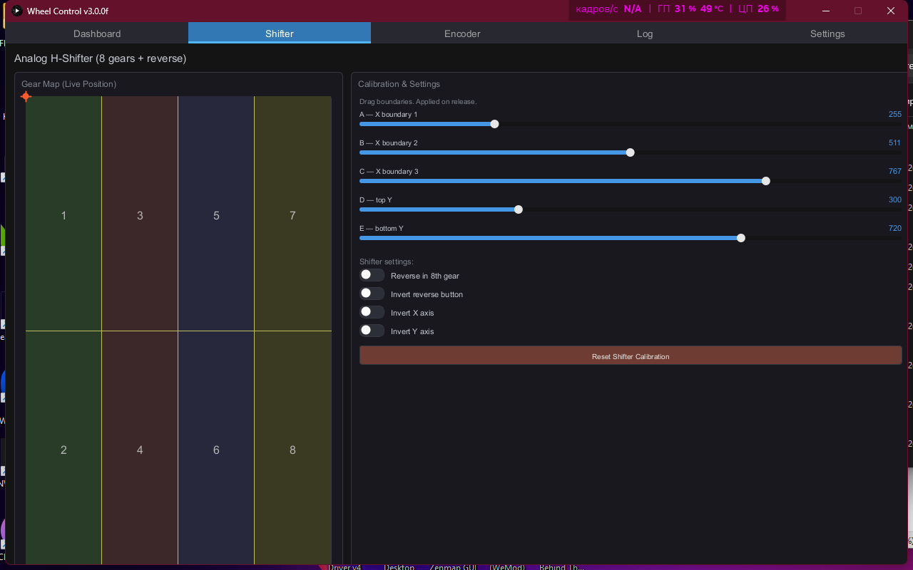
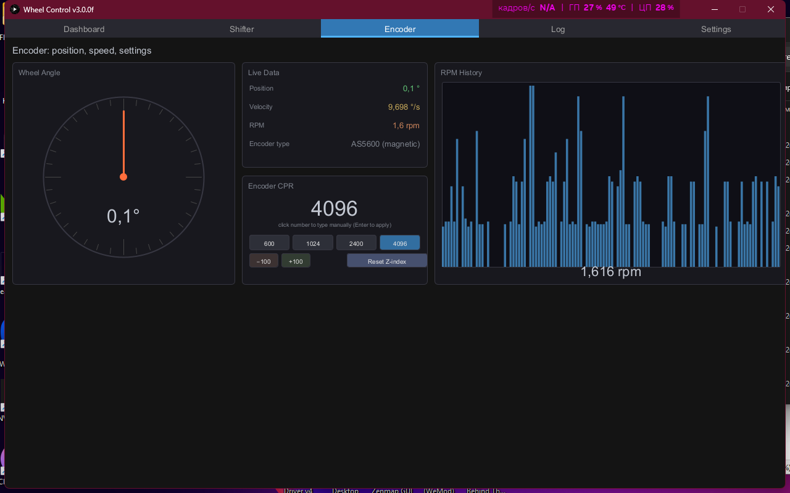
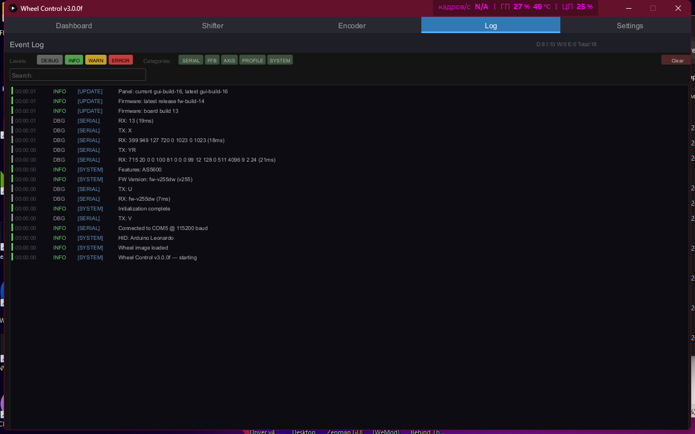
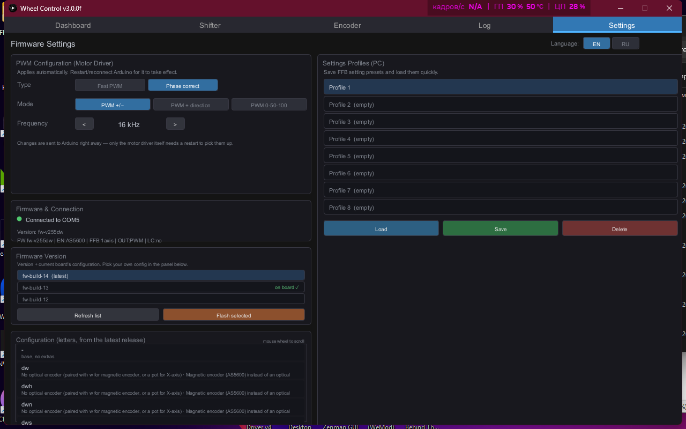

# Arduino-FFB-gui v3

A graphical user interface for controlling and monitoring all aspects of the **[Arduino FFB wheel](https://github.com/bitwiresys/Arduino-FFB-wheel-v3)** via RS232 serial port. This is a from-scratch Java rewrite of the original Processing-based GUI: same wire protocol and firmware compatibility, new interface — fully bilingual (Russian/English, switchable live in Settings), redesigned Dashboard with inline FFB-effect toggles, and settings that save to the wheel's EEPROM automatically instead of requiring a manual "Save" click. You can use a stand-alone `WheelControlApp.exe` from the **[latest release](https://github.com/bitwiresys/Arduino-FFB-gui-v3/releases/latest)** — it has the Java runtime embedded, nothing else to install.

### Hands-free setup, no manual COM-port/firmware hunting

The first-run wizard doesn't ask you to pick a COM port or a firmware file - it just says "plug the board in":
- it scans every COM port for the board's handshake (works even if the board isn't flashed yet, by watching for a new port to appear);
- if the board already has firmware, the wizard reads its configuration and offers to update it to the latest matching build automatically;
- if the board is blank, it shows a **configurator** - a plain-English list of every hardware configuration the latest release supports (encoder type, hat switch, shifter, load cell, etc.) pulled straight from the release's `manifest.json` - you pick the one matching your wiring and it installs itself.

The same configurator and version list are available any time afterward from **Settings**, so you can deliberately reflash a working board with a different configuration or an older release without redoing the wizard.

Smart reconnect: if the link drops (cable unplugged, board reset), the panel keeps retrying the saved port in the background and falls back to scanning all ports if the board reappears on a different one - no manual reconnect needed.

### Screenshots

## Download - standalone app
+ ***[Latest Release](https://github.com/bitwiresys/Arduino-FFB-gui-v3/releases/latest)***
+ ***[Past Versions](https://github.com/bitwiresys/Arduino-FFB-gui-v3/releases)***

## How to compile the source

The GUI is still written in Processing-flavored `.pde` files, but it no longer needs the Processing IDE — a small preprocessor (`pde2java.py`) converts the sources to plain Java and compiles them with a regular JDK. To build it yourself:

1. Install a **JDK 8 or newer** and **Python 3**, make sure both are on `PATH` (or set `JAVA_HOME`).
2. Clone this repository — the `lib` folder already contains the required third-party libraries (Game Control Plus, ControlP5, Sprites, jSSC), nothing to download separately.
3. Run **`build.bat`** — preprocesses, compiles, and assembles a portable `WheelControl/` folder. It runs with whatever JRE/JDK is set in `JAVA_HOME` (8+).
4. For a real standalone `.exe` that bundles its own Java runtime (what gets uploaded to Releases), run **`build-exe.bat`** instead — needs **JDK 14+** for `jpackage`. Output goes to `WheelControlApp/`.
5. On Linux/macOS/WSL, `dev.sh` does a quick preprocess+compile+run cycle for iterative development (`./dev.sh run`).

## Troubleshooting - first time run

The program looks for all virtual COM port devices plugged into your PC, but it doesn't know which COM port your Arduino is assigned to. Follow the first-time setup wizard and select your Arduino COM port from there, or if you experience a "stuck on a black/empty screen" issue, you can set it manually: locate the `data` folder next to the executable and create a text file named `COM_cfg.txt` (no `.txt` in the file name itself, that's just the file extension) containing the port, e.g. `COM5`. Save it, close it, and run the app again. You can find your port number in Device Manager under "Ports (COM & LPT)".
